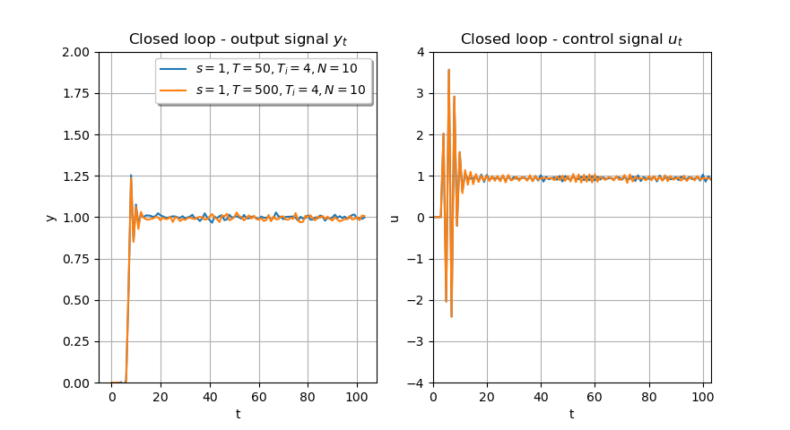

# PyDeePC

Python library that implements DeePC: Data-Enabled Predictive Control.

_Original paper_: [Data-Enabled Predictive Control: In the Shallows of the DeePC](https://arxiv.org/pdf/1811.05890.pdf)\
_Library Author_: Alessio Russo (PhD Student at KTH - alessior@kth.se)\
_License_: MIT

_Other contributors_:
    - Many thanks to [Edgar W.](https://github.com/techniccontroller) for spotting out a bug that
      let the variables  `sigma_u` and `sigma_y` assume any value when the corresponding value of
      lambda was `0`.



DeePC applied to a 3-pulley system with transfer function 
```math
T(z) = \frac{0.28z+0.51}{z^4-1.42z^3 +1.59z^2 -1.32z+0.89}
```
with sampling time Ts=0.05 [s]. Check the file in `examples\example_siso_pulley.py` for more information.

## Requirements

- Python 3.7
- Numpy, Scipy, CVXPY

## Installation

Use the `setup.py` file to install the library (execute the command `pip install .`)

## Usage/Examples

The library makes extensive use of the CVXPY library. If you are unfamiliar with CVXPY, we strongly
recommend you to first learn about CVXPY.

The algorithm can be instantiated by creating a `DeePC` object (see example below). Use
the `DeePC.build_problem` to build the optimization problem and `DeePC.solve` to solve the problem.

To learn how to use the library, check the examples located in the `examples/` folder.

In general the code has the following structure

```python
import numpy as np
import cvxpy as cp

from typing import List
from cvxpy.expressions.expression import Expression
from cvxpy.constraints.constraint import Constraint
from pydeepc import DeePC
from pydeepc.utils import Data

# Define the loss function for DeePC. The callback should accept
# 2 input/output variables, each of type Variable (see CVXPY library)
# The callback must return the objective function
def loss_callback(u: cp.Variable, y: cp.Variable) -> Expression:
    horizon, M, P = u.shape[0], u.shape[1], y.shape[1]
    # Sum_t ||y_t - 1||^2
    return cp.norm(y - 1, 'fro') + 0.1 * cp.norm(u, 'fro)

# Define the constraints for DeePC. See also how constraints are defined
# in CVXPY. The callback should accept # 2 input/output variables, each
# of type Variable (see CVXPY library). The callback must return a list of
# constraints
def constraints_callback(u: cp.Variable, y: cp.Variable) -> List[Constraint]:
    horizon, M, P = u.shape[0], u.shape[1], y.shape[1]
    # Define a list of input/output constraints
    return [y <= 10, y >= -10, u >= -20, u <= 20]

# DeePC paramters
s = 3                       # How many steps before we solve again the DeePC problem
T_INI = 5                   # Size of the initial set of data
T = 200                     # Number of data points used to estimate the system
HORIZON = 30                # Horizon length
LAMBDA_G_REGULARIZER = 0    # g regularizer (see DeePC paper, eq. 8)
LAMBDA_Y_REGULARIZER = 0    # y regularizer (see DeePC paper, eq. 8)

# Define plant
sys = ...

# Generate initial data and initialize DeePC
u = ... # define input data of length T
y = ... # apply input to system and measure output
data = Data(u, y)
deepc = DeePC(data, Tini = T_INI, horizon = HORIZON)

# Build the deepc problem
deepc.build_problem(
    build_loss = loss_callback,
    build_constraints = constraints_callback,
    lambda_g = LAMBDA_G_REGULARIZER,
    lambda_y = LAMBDA_Y_REGULARIZER)

# Simulate for a number of steps
for idx in range(300):
    # Update initial data and solve DeepC
    u_optimal, info = deepc.solve(data_ini = data_ini)

    output = ... # Apply optimal control input of size s to the system and measure output
    data_ini = Data(..., ...) # Use last T_INI samples to build a new initial condition
```

## Known problems

- When using the projection regularizer you may encounter some problems while using the ECOS solver. We suggest setting the regularizer to 0, or using another solver (e.g., MOSEK)

## TODO

- Add tests

## License

Our code is released under the MIT license

[](https://opensource.org/licenses/MIT)
